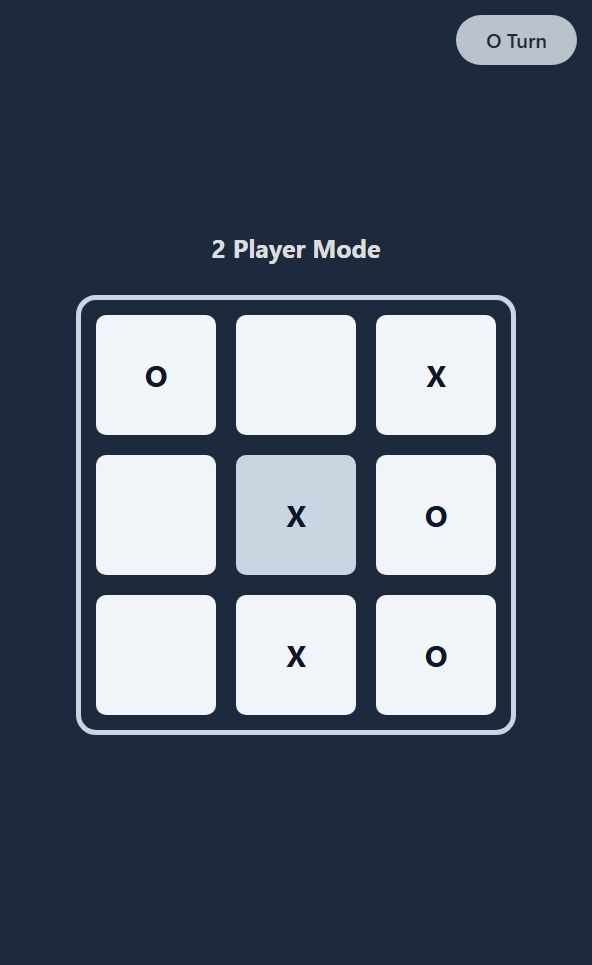

# Tic-Tac-Toe using Typescript 

With my limited understanding of Typescript, I tried to create a simple Tic-Tac-Toe game.

## Features

- Bot mode (play against bot)
- 2 Player mode (play against yourself)
- Online mode (not yet implemented!)

## TODO

- Add online mode

